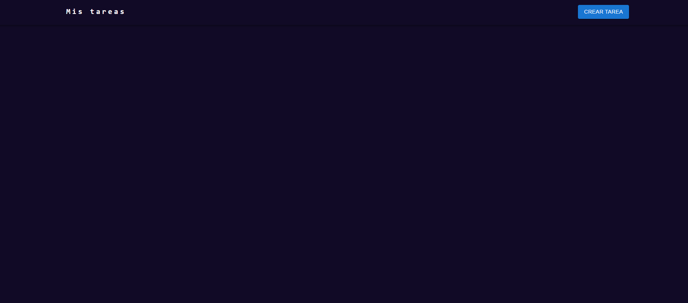
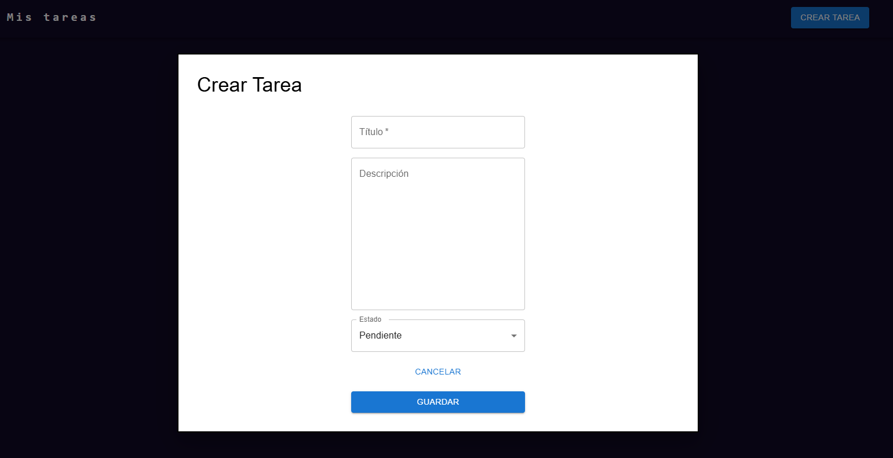
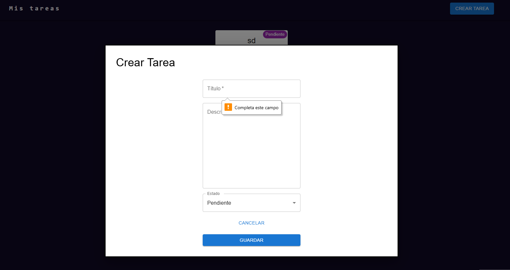
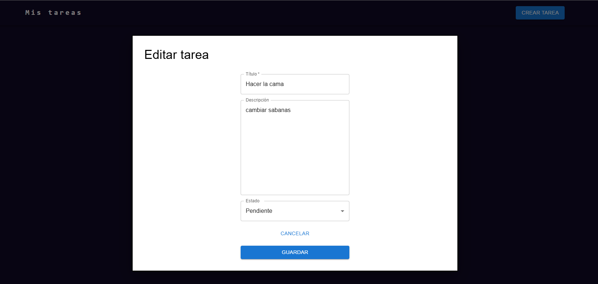
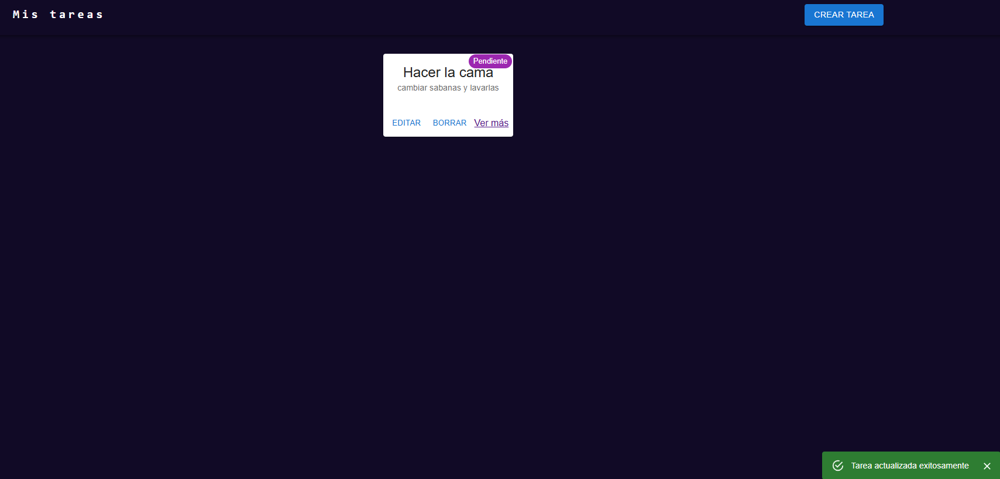
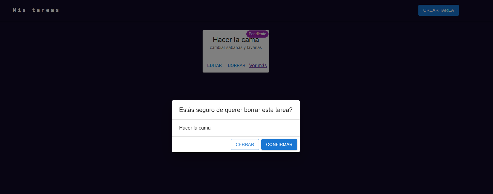
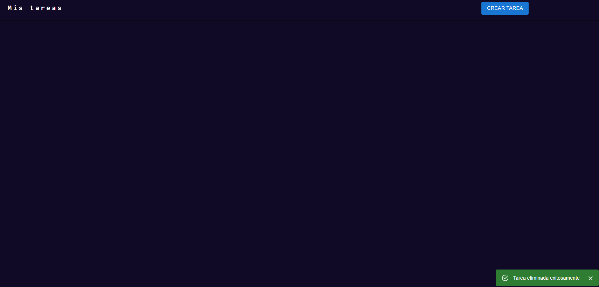
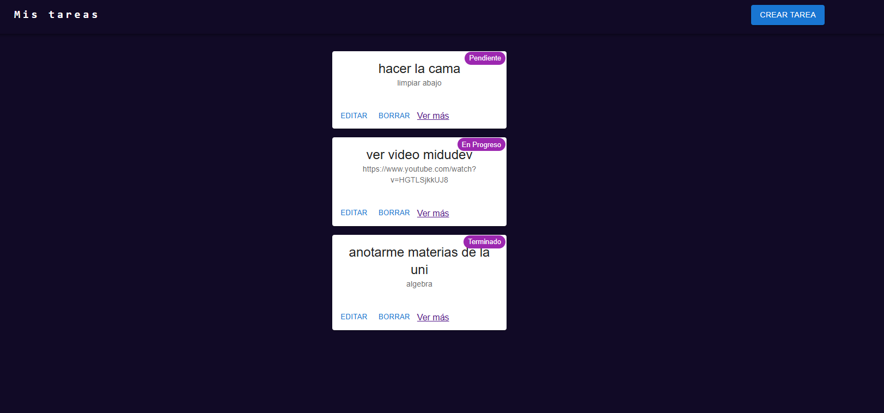
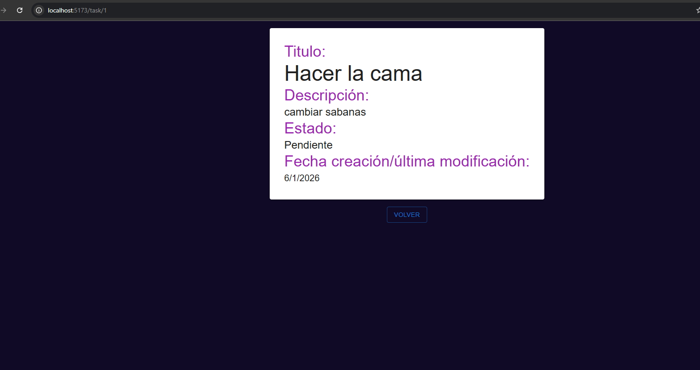

# AcademiaForItFront

Proyecto frontend CRUD de tareas que se comunica con un proyecto backend en Node + Express.

---

## Instalaciones extra

- MUI(Material UI): biblioteca de componentes React de código abierto.
- eslint: detecta errores de sintaxis y problemas de estilo.
- react-router-dom : para manejo de rutas.

Puedes instalar todas las dependencias ejecutando:

- npm install

---

## Scripts para correr el proyecto

1. npm install
2. npm run dev

- dev: ejecuta el proyecto

---

## Archivos adicionales

- .gitignore: Para ignorar archivos y carpetas que no deberían subirse a Git.

- eslint.config.js: Configuración de ESLint

## Imagenes de API funcionando

### Home

### Crear tarea

### Editar tarea

### Borrar tarea

### Listar tareas

### Ver tarea en nueva pestaña

### Url mal

